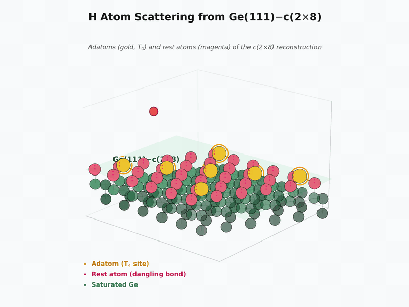
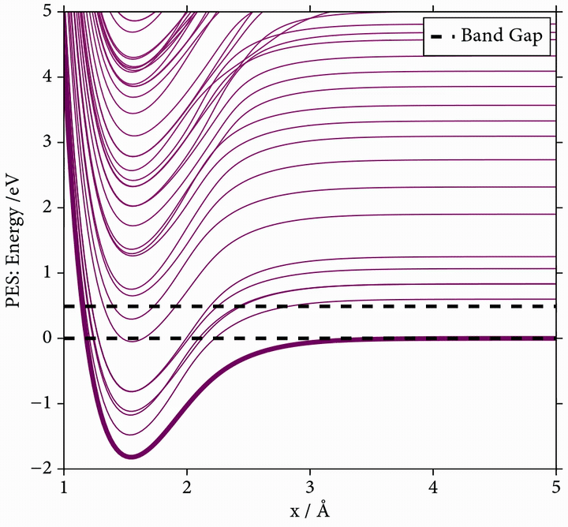

# HonGeAnalysis

[](https://github.com/NQCD/HonGeAnalysis/actions/workflows/CI.yml)


The repository is developed by [Xuexun (or Hokseon in Cantonese)](https://louhokseson.github.io) and aims to reproduce the simulations and plots showed in the publication on JCP:
> [A Haldane-Anderson Model Hamiltonian for Hyperthermal Hydrogen Scattering from a Semiconductor Surface](https://doi.org/10.1063/5.0297254) by Xuexun Lu, Nils Hertl, Sara Oregioni, Riley J Preston, Samuel Louis Rudge, Michael Thoss, Rocco Martinazzo and Reinhard J. Maurer.

### Schematic Animation of H-Atom Scattering from Ge(111)-c(2×8)

<p align="center">
  
</p>
<p align="center">
  <em>Animation 1. Schematic animation of an H atom scattering from the Ge(111)-c(2×8) reconstructed surface. Gold spheres are T<sub>4</sub> adatoms and magenta spheres are rest atoms (¼ ML each). The trajectory, surface vibrations, and electron excitations are illustrative only.</em>
</p>

However, this project applies a 1-D analytical model to represent the nonadiabatic effects during the scattering process. **Animation 1 is for illustrative purpose only.**

### Dynamics methods

In this project, we apply two mixed quantum-classical dynamics methods, Ehrenfest and Independent Electron Surface Hopping (IESH), to simulate the scattering process. The simulation parameters are listed in the [parameters_IESH.jl](/scripts/simulation_IESH/parameters_IESH.jl) and [parameters_Ehrenfest.jl](/scripts/simulation_Ehrenfest/parameters_Ehrenfest.jl) for reference.

<div align="center">

#### Surface hopping dynamics: Independent Electron Surface Hopping (IESH)
</div>

**The idea, in plain words.** The H atom does *not* roll on a single potential-energy curve — it lives on a whole *manifold* of curves, one for each electronic state of the surface. **Surface hopping** lets the atom randomly jump between neighbouring curves to mimic non-adiabatic energy exchange between the nucleus and the electrons. Hopping **up** loses kinetic energy to the electrons (the atom slows down); hopping **down** gives it back (the atom speeds up). Because the hops are *stochastic*, atoms launched with **identical** speed and position can take very different paths through the manifold and exit on different curves — exactly what the three coloured markers below illustrate.

<p align="center">
  
</p>
<p align="center">
  <em>Animation 2. Three H-atom markers launched with identical kinetic energy from x = 4.7 Å follow different stochastic hop sequences — cyan (6 hops), yellow (3 hops), lime (0, elastic).  This illustrates the random nature of surface hopping. Schematic only.</em>
</p>

### Instructions from the author

##### Activate the Julia environment
<details>
<summary><strong>Steps</strong></summary>

After cloning this repository to your machine, you need to the followings
1. Turn on the Julia REPL where you terminal need to be at the root of this repository
   ```julia
   (@v1.10) pkg> activate .
   ```
   Add `HokseonRegistry` to the julia environment so that you could access some personal packages Hokseon has developed for filing and plotting purposes.
   ```julia
   (HonGeAnalysis) pkg> registry add https://github.com/Louhokseson/HokseonRegistry
   ```
   Also, the NQCDRegistry is needed to access the NQCD family packages.
   ```julia
   (HonGeAnalysis) pkg> registry add https://github.com/NQCD/NQCRegistry
   ```
2. If you managed to activate the project environment, you should see the prompt
   ```julia
   (HonGeAnalysis) pkg> 
   ```
3. Resolve the dependencies / equivalent to rewrite the [Manifest.toml](./Manifest.toml) based on the [Project.toml](./Project.toml)
   ```julia
   (HonGeAnalysis) pkg> resolve
   ```
4. Instantate the dependencies / equivalent to download the packages listed on [Project.toml](./Project.toml)
   ```julia
   (HonGeAnalysis) pkg> instantiate
   ```
5. Last step is to double check you have the correct version of the `NQCDynamics.jl` (v0.13.4) and its companion package, `NQCModels.jl` (v0.8.19) in the julia enviroment.
   ```julia
   (HonGeAnalysis) pkg> status NQCDynamics
   ```
   If you see the version is not correct, you can use the following command to update the package.
   ```julia
   (HonGeAnalysis) pkg> add NQCDynamics@0.13.4
   ```
   Exact same procedure applies to `NQCModels.jl` package.
</details>

For those who are confident with Julia and skip the folded instructions, you are highly recommended to check your installed version of `NQCDynamics.jl` and `NQCModels.jl` packages are v0.13.4 and v0.8.19 respectively. If you are not sure, please follow the folded content in **Steps**.


##### Figure data & plotting scripts
In the directory `figure_data`, you can find the data in `.txt` used to generate the figures in the manuscript. The Julia scripts for those plots sit in the `scripts/plots`. 


##### Ab-initio calculated data
The ab-initio data is stored in directory `data/ab-initio_cals`. The specs of the DFT calculations is illustrated the manuscript.


##### Experimental data
The H atom scattering on Ge(111) surface data is published and available in 
> 
[Krüger, K., Wang, Y., Tödter, S. et al. Hydrogen atom collisions with a semiconductor efficiently promote electrons to the conduction band. Nat. Chem. 15, 326–331 (2023).](https://doi.org/10.1038/s41557-022-01085-x)


<details>
<summary><strong>Practical Tips</strong></summary>

This repo should be ready in some machines that Hokseon can use by the time he comes back to it. i.e. Archer2 and Taskfarm.
- If you need to configure a new machine, please follow the step you wrote below. Because with the given UUID of NQCDynamics and NQCModels, julia package git installer would automatically download v0.15.0. Make sure that you do
```julia
(HonGeAnalysis) pkg> add NQCDynamics@0.13.4
```
in your configure script for that machine.Same applies to `NQCModels.jl` which has to be either v0.8.20 or v0.8.19.
- Make sure `data` folder has folder `sims`. Within `sims` should have `Ehrenfest`, `IESH` and `Individual-Large`. The first two are used for storing the raw `.h5` output from NQCD simulation. Each of the `.h5` should be named after the simulation parameters ([parameters_IESH.jl](/scripts/simulation_IESH/parameters_IESH.jl) for reference). The given run scripts (Ehrenfest/IESH) would skip taht simulation if the conjugate output `.h5` exist in folder `Ehrenfest` or `IESH`.
- When you need to do repeating simulations (mostly IESH for energy loss/ sticking probability convergence), make sure you turn the `is_dividual_large_saving = true` in the parameters_IESH.jl for simualtions. For example, 500 trajectories for a `.h5` for 1000 times.
- When you have generated massive amount of .h5 file under folder `Individual-Large/your_simulation_parameter...`, you need to process/extract the useful properties by 
1. Run [traj2kineticloss.jl](/scripts/data_engineering/traj2kineticloss.jl) and [traj2nstick.jl](/scripts/data_engineering/traj2nstick.jl) (order of executing does not matter since they are independent). These two generate folder `scattering_counting` and `scattered_kinetic_loss` containing `.csv` with the desired properities (including confidence errors) from the NQCD simulated `.h5` data.  The `.csv` is easy for storage and rsyncing between machines.
- Rsyncing the whole folder from HPCs to storage machine to process the [traj2kineticloss.jl](/scripts/data_engineering/traj2kineticloss.jl) and [traj2nstick.jl](/scripts/data_engineering/traj2nstick.jl). `rsync -avn` is a dry run. testing whether the stuff can be send to desitnation. The actually syncing need `rsync -av` 

**Whole folder rsyncing**
```bash
rsync -avn your-path-to-the-folder destination
```
**Files inside folder rsyncing**
```bash
rsync -avn your-path-to-the-folder/ destination
```

- Rsyncing the processed `.csv` to a local laptop:
**Exclude .h5 files**
```bash
rsync -avn --exclude='*.h5' source destination
```

##### NQCD output data
You should save NQCD output in `data/sims` directory. After running the simulations, you would have the following structure
```data
└── sims
    ├── Ehrenfest
    │   ├── configuration.h5
    ├── IESH
    │   ├── configuration.h5
    └── Individual-Large
        └── configuration
            ├──JOB_ID_XXXXX.h5
```

1. You can find the raw data files with extension of `.h5` which contain the raw ouput from the [NQCDynamics.jl](https://github.com/NQCD/NQCDynamics.jl) simulation from the folder Ehrenfest and IESH. The name of the files indicate the simulation parameters, e.g.,
```
centre=0_couplings_rescale=1.95_discretisation=GapGaussLegendre_dt=0.01_gap=0.49_impuritymodel=Hokseon_incident_energy=0.3_is_Wigner_initial=false_mass=1.01_method=EhrenfestNA_nstates=150_temperature=300.0_tmax=1000_trajectories=1_width=50.h5
```
contains the simulation of 500 trajctories of the Ehrenfest dynamics with desired output variables along the dynamics.
2. The Individual_Large directory contains folders with name illustrating the simulation parameters, e.g.,
```
centre=0_couplings_rescale=1.95_decoherence=EDC_discretisation=GapGaussLegendre_dt=0.05_gap=0.49_impuritymodel=Hokseon_incident_energy=0.25_is_Wigner=false_mass=1.01_method=AdiabaticIESH_nstates=150_temperature=300.0_tmax=1001_trajectories=500_width=50
```
Inside, it contains the processed data from a large set of simulations and stored in the `.csv` files. Those `.csv` files are named with the distinct job id of each julia simulation.
</details>

<p>&nbsp;</p>

<details>
<summary><strong>Acknowledgements</strong></summary>

**Fundings**

- EPSRC Doctoral Training Partnership
- MSCA Postdoctoral Fellowship 
- Erasmus+ Traineeship Mobility 
- Alexander von Humboldt Research Fellowship
- DFG Grant
- UKRI Future Leaders Fellowship
- UKRI Frontier Research Grant

**Computational Resources**
- Scientific Computing Research Technology Platform (SCRTP) in University of Warwick
- Archer2 UK National Supercomputing Service
- Sulis HPC Midlands+ Computing Centre 
- bwHPC (Baden-Württemberg High Performance Computing)

**Hosting Institutions**

<p align="center">
  <a href="https://warwick.ac.uk" target="_blank">
    
  </a>
  <a href="https://www.uni-freiburg.de" target="_blank">
    
  </a>
  <a href="https://www.univie.ac.at" target="_blank">
    
  </a>
  <a href="https://www.unimi.it" target="_blank">
    
  </a>
</p>

</details>


